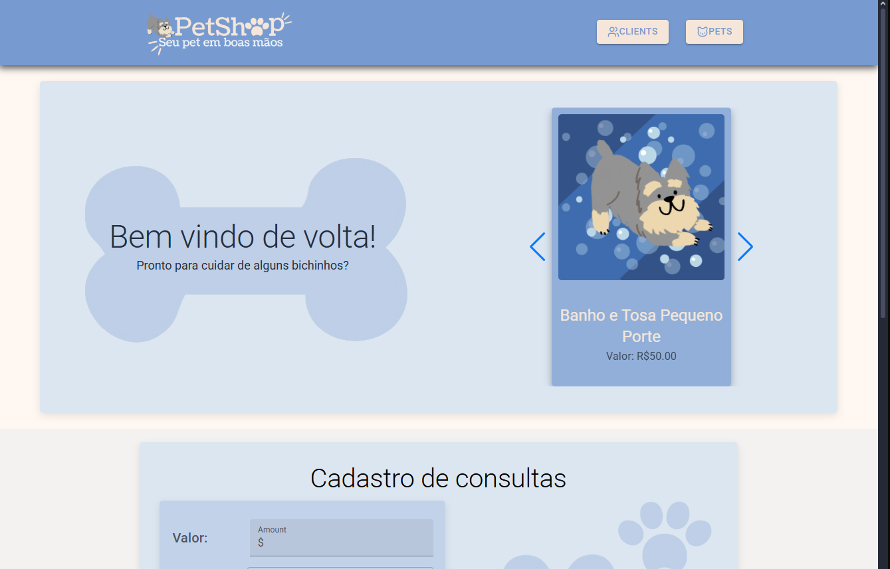

# PetShop FullStack

## Sobre o projeto 🚀
Essa aplicação foi criada no intuito de aprofundar meus conhecimentos sobre a arquitetura e a comunicação entre frontend e backend.

Se trata de um sistema de PetShop, permitindo a administração de clientes, animais, agendamentos de consultas e serviços prestados. 

No Backend, foi utilizado Java e Spring Boot para construir a API REST, com a persistência de dados sendo feita em um banco MySQL rodando dentro de um container Docker. 

No frontend, foi utilizado React com Typescript para criar uma interface moderna e responsiva, utilizando a abordagem "Mobile-First". Além disso, o uso de bibliotecas como Material UI e Lucide contribuiram para um visual mais agradável e funcional.

## Telas da aplicação 🖥️
<h1 align="center">
    
    
    
    
</h1>

## Modelo conceitual 📝
<h1 align="center">
    
</h1>

## Tecnologias utilizadas 💻
- Java
- Spring Boot
- JPA / Hibernate
- Docker
- MySQL
- TypeScript
- React

## Como executar a aplicação ✔
Para rodar a aplicação, primeiro subimos o container Docker com a imagem do banco de dados, em seguida, iniciamos a API Spring Boot, e por fim, iniciamos o React.

- Primeiro, você deve clonar o projeto na sua máquina, para isso você
pode colar o seguinte comando em seu terminal

```bash
git clone https://github.com/rafaelsouzapinto/Petshop-fullstack.git

```

- No backend, para acessar a pasta e subir o container do banco de dados, você
pode usar os seguintes comandos em seu terminal:

```bash
cd backend-petshop
docker-compose up -d
```

- Por fim, basta entrar na classe `PetshopApplication` e iniciar o projeto.

---

- Já no frontEnd, para acessar a pasta, instalar as dependencias e rodar o projeto, você
pode usar os seguintes comandos em seu terminal:

```bash
cd frontend-petshop
npm install
npm run dev
```


## Autor ✏
<p>
    
    <p>&nbsp&nbsp&nbspRafael Souza<br>
    &nbsp&nbsp&nbsp
    <a href="https://github.com/rafaelsouzapinto">
    GitHub</a>&nbsp;|&nbsp;
    <a href="https://www.linkedin.com/in/rafaelsouzapinto/">LinkedIn</a>
&nbsp;|&nbsp;
    <a href="https://www.instagram.com/antonyrafaeo/">
    Instagram</a>
&nbsp;|&nbsp;</p>
</p>
<br/><br/>
<p>
